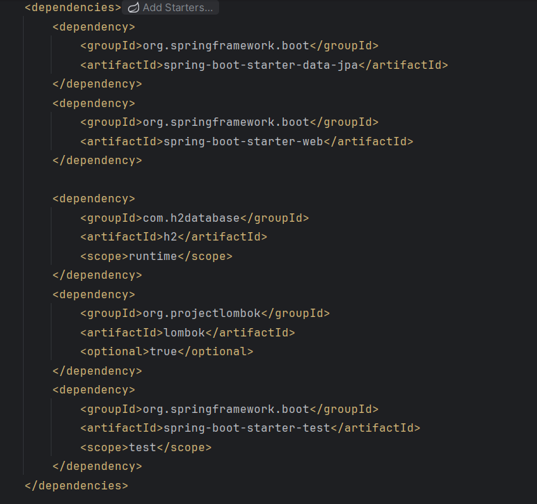
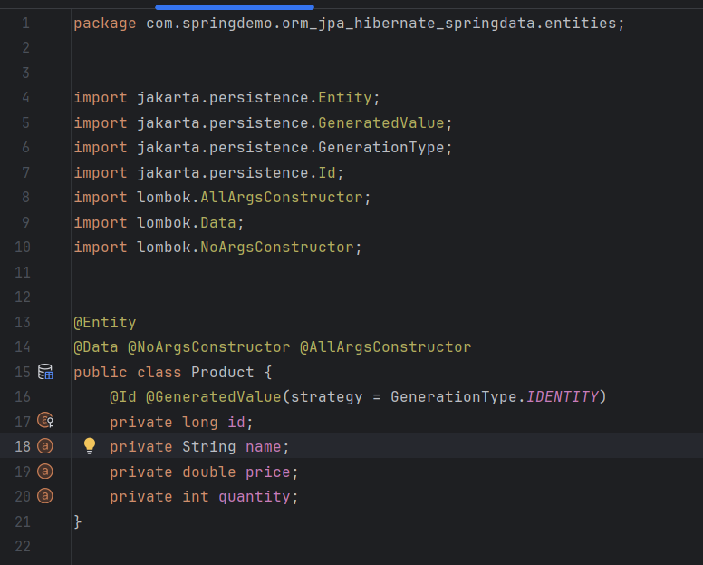
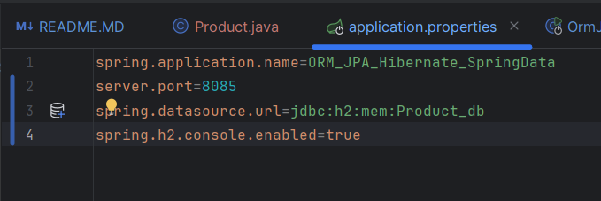
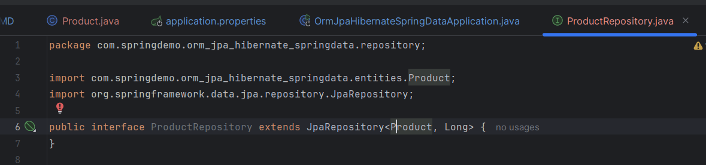
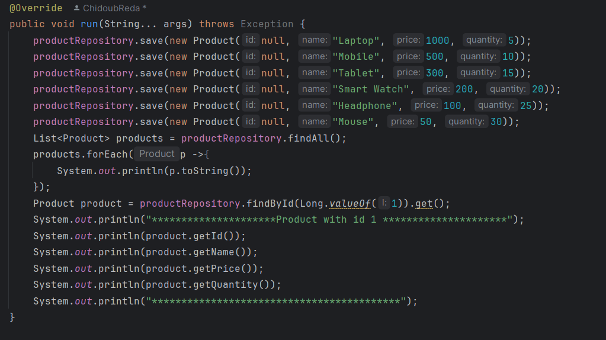
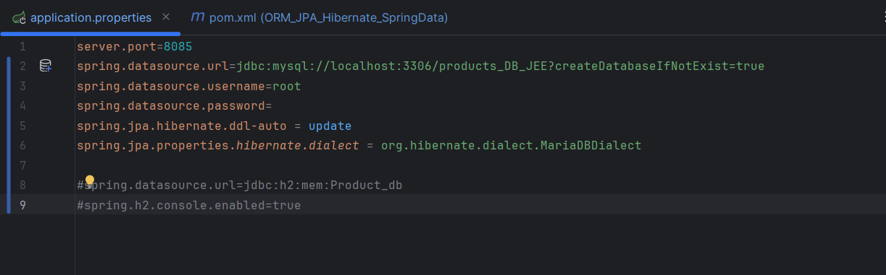
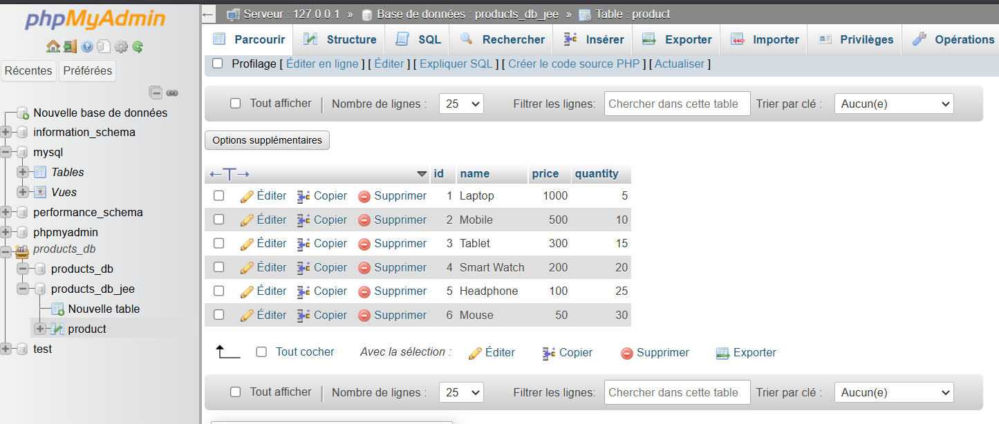

<h2>Créer un projet Spring Initializer avec les dépendances JPA, H2, Spring Web et Lombock</h2>

<h2>Créer l'entité JPA Product ayant les attributs :
- id de type Long
- name de type String
- price de type double
- quantity de type int</h2>
- 
<h2>Configurer l'unité de persistance dans le ficher application.properties </h2>

<h2>Créer l'interface JPA Repository basée sur Spring data</h2>

<h2>Tester quelques opérations de gestion de produits</h2>

<h2>Migrer de H2 Database vers MySQL</h2>

